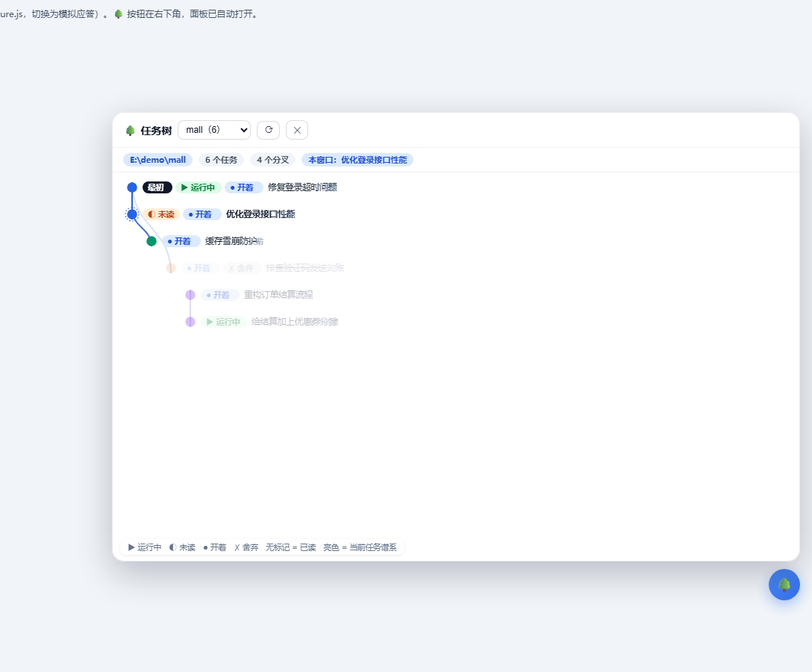

# zcode-branch-tree · ZCode 任务树

给 [ZCode](https://zcode.ai) 桌面客户端（Electron 应用）加一个悬浮 🌳 按钮和**思维导图式的任务树面板**：按项目查看全部任务，主线一条线、`fork` 分叉画出岔道；当前任务的**谱系**自动高亮（最初任务 → … → 当前 → 分出的分支）；每个节点带**状态**（运行中 / 未读 / 已读 / 舍弃）与**摘要**（分支时的语句）；点节点查看详情并一键**切换任务**。



> 上图为 demo 页合成数据截图；真实使用时显示的是你本机的任务。数据**全程只读、不联网**。

平台：Windows ｜ 许可：[MIT](LICENSE)

## 功能

- **项目 → 任务基因树**：泳道布局（布局算法为纯函数，带单元测试），一个项目一条主线，`fork` 分叉画出岔道；悬停任意节点显示 标题 / 类型 / 状态 / **任务第一句**。
- **谱系高亮**：本窗口当前任务自动成为焦点——从**最初任务**（「最初」胶囊）沿链到当前（虚线环），连同它分出的所有分支一起亮显，其余无关任务淡显。
- **节点状态**（真实数据源，见「数据与隐私」）：

  | 标记 | 含义 | 来源 |
  |---|---|---|
  | ▶ 运行中（绿） | 任务正在执行 | 客户端任务索引 `task_status = running` |
  | ◐ 未读（橙） | 有未读动静 | 客户端任务索引 `unread_at` |
  | 无标记 | 已读 | 默认态 |
  | ● 开着（蓝） | 正在某窗口打开 | 主进程窗口-任务映射 |
  | 📌 | 已置顶 | 客户端任务索引 |
  | ✗ 舍弃（灰+删除线） | **你手动标注的舍弃** | 本工具 `marks.json`，面板一键标记/取消 |

- **节点详情**：任务第一句（分叉任务显示「分支时的语句」，主线任务显示「任务最初的输入」）、最初 → … → 本任务的谱系面包屑（可点击跳转）、分出的分支列表、轮数 / 请求数 / tokens、代码 +新增/-删除 行数。
- **切换任务**（三层兜底）：① 任务已在某窗口打开 → 直接聚焦该窗口；② 点击客户端自身任务列表里的对应元素，走它自己的切换逻辑；③ 展示并复制 `zcode --resume <任务id>` 终端命令。
- **实时刷新**：监听任务库目录（事件驱动，无轮询），任务有新动静面板自动更新；空闲时零开销。
- 开发友好：`overlay.js` / `taskq.py` 改动后约 2 秒热更新生效（语法校验通过才注入）。

## 安装

前置条件：Windows；[Python 3.8+](https://www.python.org/)（仅安装器与查询层使用，零第三方依赖）；git 在 PATH。

```bash
git clone https://github.com/AIYiMeng/zcode-branch-tree.git
cd zcode-branch-tree
python install.py
```

`install.py` 会自动完成：探测 ZCode 安装位置（默认候选目录 → 找不到时询问，或用
`--asar` / 环境变量 `ZCODE_ASAR` 指定）→ 复制运行时到 `~/.zcode/zcode-branch-tree/`
→ 生成 config.json → 备份并注入 app.asar → 自检 → 原子替换。**ZCode 无需退出，
安装完成后重启 ZCode 生效**，窗口右下角出现 🌳 按钮。

- 指定安装位置：`python install.py --asar "<ZCode安装目录>\resources\app.asar"`
- 只想看看会做什么：`python install.py --dry-run`
- 二次确认注入状态：`python patch_install.py check`（非默认位置加 `--asar`）

**安装时 ZCode 正在运行也没关系**：最后一步替换若被运行中的客户端锁住，会自动弹出
「安装收尾监控」窗口——之后**完全退出 ZCode** 即可（托盘右键退出；只关窗口不行，
后台服务会留在内存里，必要时用任务管理器结束全部 ZCode 进程），监控窗口会自动完成
替换。若关掉了监控窗口，可双击仓库里的 `手动收尾.bat`，或双击安装时生成在数据目录的
`收尾-双击我.bat`（`~/.zcode/zcode-branch-tree/`，已内置本机 Python 绝对路径，
不依赖 PATH）。收尾后再启动 ZCode 即生效。

> 与 [zcode-token-usage-statusbar](https://github.com/xhwxt/zcode-token-usage-statusbar) 使用不同的注入标记（`inject-branchtree.cjs` vs `inject-main.cjs`），**两者可以共存**，互不影响、各自卸载。

## 使用

1. 点右下角 🌳 打开面板（ESC 或 ✕ 关闭）。
2. 顶部下拉框切换项目；状态行显示项目目录、任务数、分叉数、本窗口当前任务。
3. 树中每个节点是一个任务：**亮色 = 当前任务谱系**，淡显 = 无关任务；胶囊含义见上表；悬停看摘要。
4. 点节点打开右侧详情：谱系面包屑、分支语句、用量与代码统计。
5. **切换到此任务**：一键走三层兜底；**标记为舍弃** / **取消舍弃**：自定义状态；**复制 resume 命令**：终端里继续该任务。

## 卸载与关闭注入（重要）

注入的本质是修改 ZCode 安装目录里的 `app.asar`（修改前已自动备份）。三种力度任选：

> **路径说明**：ZCode 装在默认位置 `D:\ZCode` 时，下面的命令直接可用；装在其它位置时，
> 给命令加一个 `--asar` 参数指向你的 app.asar，例如
> `--asar "E:\Apps\ZCode\resources\app.asar"`。也可以设一次环境变量 `ZCODE_ASAR`
> 指向它，一劳永逸。另外**安装成功后本工具会记住安装位置**，之后的卸载/更新一般无需再传。

### ① 完整卸载（推荐：恢复客户端 + 清理全部数据）

先**完全退出 ZCode**（托盘图标也要退出），然后：

```bash
cd zcode-branch-tree
python install.py --remove          # 非默认位置：--asar "<ZCode安装目录>\resources\app.asar"
```

它会：定位 ZCode（记住的安装路径 → 自动探测 → 环境变量 → 都失败则提示 `--asar`）→
从备份 `app.asar.btree.bak` 恢复原版 asar → 删除数据目录 `~/.zcode/zcode-branch-tree/`
（运行时、配置、舍弃标注）。即使找不到 app.asar（如 ZCode 已卸载），数据清理也会完成。

### ② 只关闭注入（保留配置和舍弃标注，随时可再启用）

适合暂时不想用、但以后还会开的情况：

```bash
python patch_install.py remove      # 恢复原版 asar（需先退出 ZCode；非默认位置加 --asar）
python patch_install.py check       # 确认显示"未注入"
```

之后再启用：`python install.py`（自动识别安装位置，注入行不变时秒级完成，推荐）。

### ③ 手动恢复（极端情况兜底）

- 备份文件在 ZCode 安装目录：`resources\app.asar.btree.bak`。手动恢复 = 退出 ZCode 后，把它改名回 `app.asar`（覆盖现有文件）。
- 若安装时 ZCode 正在运行导致替换挂起，目录里会出现 `app.asar.btree.tmp`：完全退出 ZCode 后，最省事的是双击 `手动收尾.bat`（或数据目录的 `收尾-双击我.bat`）；或命令行执行 `python patch_install.py install --finalize`（非默认位置加 `--asar`）；都不要就删掉 .tmp 用备份恢复。
- 卸载不会动 ZCode 的任何任务数据（本工具对任务库**只读**）。

## 更新

```bash
git pull
python install.py        # 注入行不变时秒级完成；改了 loader 才需要重启 ZCode
```

ZCode 官方升级会覆盖 `app.asar`，悬浮条消失时重跑一次 `python install.py` 即可。
更新/重装时若 ZCode 正在运行，同样走上面的「收尾监控 / 手动收尾」流程（注入行不变时
只是同步 overlay 副本，无需动 asar，也就不需要收尾）。

## 常见问题

| 现象 | 处理 |
|---|---|
| 重启后没有 🌳 按钮 | `python patch_install.py check` 看注入状态；多半是 ZCode 升级覆盖了 asar，重跑 `python install.py` |
| 双击收尾脚本提示 "'python' 不是内部或外部命令" | cmd 的 PATH 里没有 Python。用数据目录里由 install.py 生成的「收尾-双击我.bat」（`~/.zcode/zcode-branch-tree/`，已内置本机 Python 绝对路径）；或在 PowerShell 里 `py -3 -m patch_install install --finalize` |
| 完全退出后收尾仍提示"ZCode 正在运行" | 后台服务进程未退尽：任务管理器结束所有 ZCode 进程（本项目已内置 PowerShell 兜底检测，正常不会误报） |
| 面板显示"读取失败" | 确认 `~/.zcode/cli/db/db.sqlite` 存在；看 ZCode 主进程日志中 `[btree]` 前缀输出 |
| 切换落到了 resume 命令 | 目标任务未在桌面端打开且未渲染在任务列表里，属预期兜底 |
| 任务树缺少很老的任务 | 默认取最近 500 个未归档任务，改数据目录 `config.json` 的 `max_sessions` 后等一次刷新 |

## 工作原理

```
app.asar 入口尾部 +1 行 dynamic import（备份 → 重打包 → 自检 → 原子替换）
  └─ inject-branchtree.cjs（主进程 loader）
       ├─ 向每个窗口注入 overlay.js（悬浮按钮 + 任务树面板）
       ├─ RPC：收割页面请求队列 → 执行 → 回推（tree / focus / mark / ping）
       ├─ 常驻 python：taskq.py serve（只读任务库，行协议；异常自动回退一次性查询）
       ├─ 每窗口活跃任务：复用客户端自带 IPC 通道维护 窗口 → 会话 映射
       └─ fs.watch 任务库目录 → 面板节流自动刷新
```

**数据与隐私**：只读本机 `~/.zcode/cli/db/db.sqlite`（session / model_usage / turn_usage）与 `~/.zcode/v2/tasks-index.sqlite`（客户端任务索引）；**全程不联网、不写任何 ZCode 数据**；唯一写入的是本工具数据目录（运行时副本 / config.json / marks.json 舍弃标注）与安装期的 asar 备份。RPC 操作白名单，任务 id 走字符校验。

## 开发

```bash
node test/layout.test.js              # 布局算法单测
python taskq.py dump                  # 直接查看任务数据（JSON）
python tools/gen_fixture.py           # 用真实任务库生成 demo fixture（本地预览用）
python tools/gen_demo_fixture.py      # 生成合成数据 fixture（截图/公开演示用）
# 浏览器打开 demo/demo.html           # 无需 ZCode 的界面演示
python install.py --dev               # 开发模式：注入直指仓库，热更新即改即达
```

| 文件 | 作用 |
|---|---|
| `install.py` | 一键安装/卸载（复制运行时 → 注入 asar → 记住路径 → 生成个性化收尾脚本） |
| `patch_install.py` | asar 注入/卸载底层（备份→重打包→自检→原子替换；支持 `--asar`/`--runtime`/`--finalize`） |
| `inject-branchtree.cjs` | 主进程 loader：注入 + RPC + 常驻查询 + db 监听 + 每窗口活跃任务 + 窗口聚焦 |
| `taskq.py` | 任务查询层（只读双库：会话谱系/用量 + 客户端任务索引状态；serve/dump） |
| `overlay.js` | 悬浮按钮 + 任务树面板（paint() 布局、谱系高亮、状态标记、三层切换） |
| `finalize_watch.py` | 安装收尾监控（等客户端完全退出后自动完成 .tmp 替换） |
| `手动收尾.bat` | 手动收尾脚本（python → py 双兜底；数据目录另生成个性化版「收尾-双击我.bat」） |
| `tools/gen_fixture.py` | 从真实任务库生成演示/测试数据（本地用，不入库） |
| `tools/gen_demo_fixture.py` | 生成合成数据 fixture（README 截图/公开演示，不含真实任务） |
| `tools/asar_grep.py` `tools/asar_ctx.py` | 客户端 bundle 只读检索（逆向定位 IPC 通道/界面结构，支持 `ZCODE_ASAR` 环境变量） |
| `demo/` | 浏览器演示页（合成数据渲染 + 模拟任务列表验证 DOM 切换） |
| `test/` | 布局单测（paint() 不变量）+ Python 语法检查 |

## 致谢

- [xhwxt/zcode-token-usage-statusbar](https://github.com/xhwxt/zcode-token-usage-statusbar)（MIT）：asar 重打包/自检机制、常驻 python 行协议、db 目录监听、每窗口活跃任务 IPC 等模式的来源；本项目的注入标记与其独立、可共存。
- 任务数据模型来自 ZCode 客户端本地的公开结构（session 表 `parent_id` / `project_id` / `task_type`）。

## License

[MIT](LICENSE)
